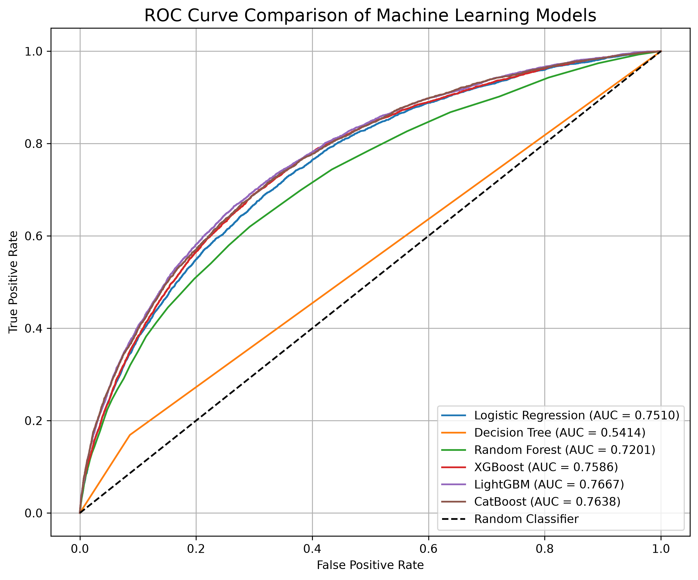
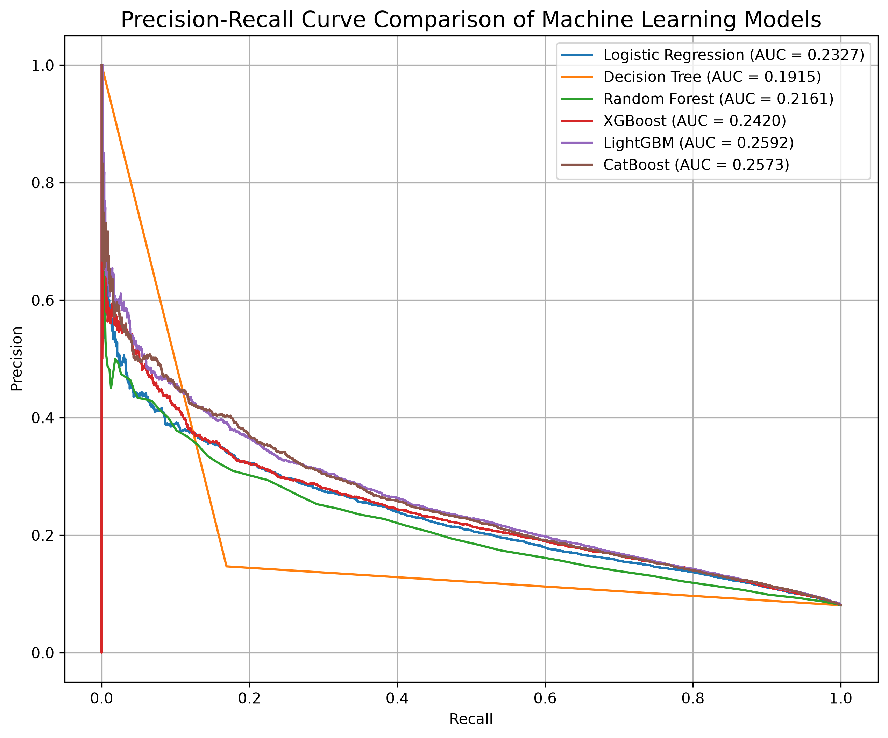
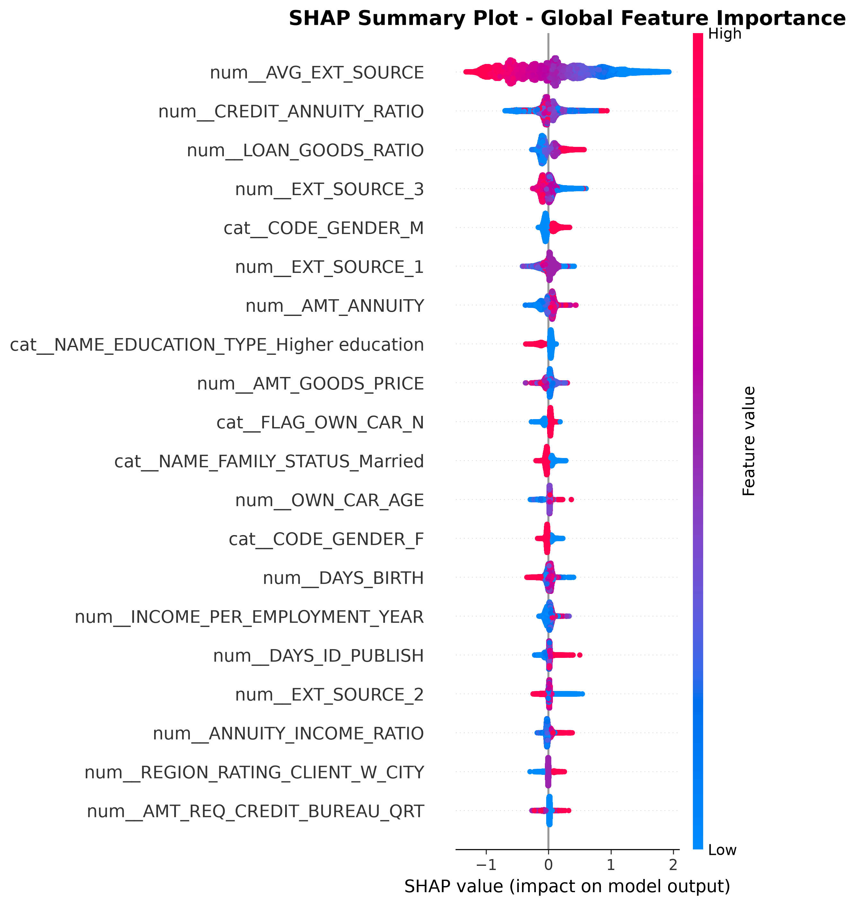
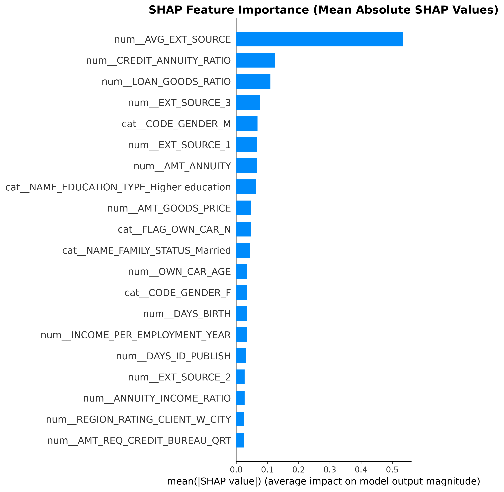
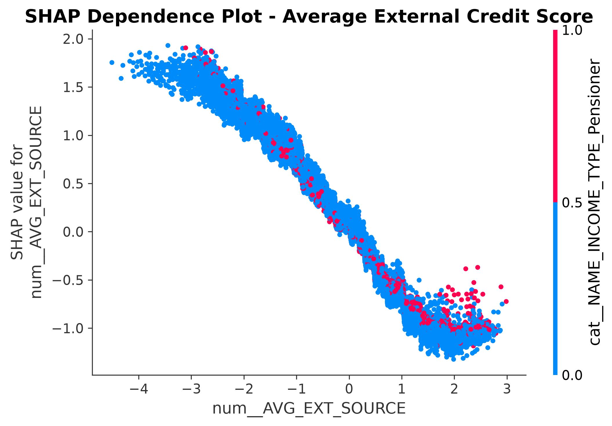
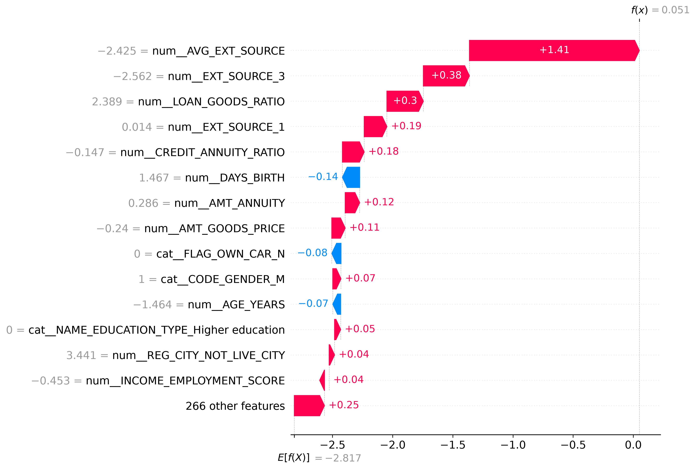

# Advanced Credit Risk Modeling using Machine Learning


---

##  Project Overview

Financial institutions process thousands of loan applications every day. Approving loans for applicants who are likely to default can result in substantial financial losses, while rejecting reliable applicants reduces business opportunities and customer satisfaction.

This project develops an end-to-end **Credit Risk Prediction System** using machine learning to estimate the probability that a borrower will default on a loan. Starting from raw applicant data, the project covers data preprocessing, exploratory data analysis, feature engineering, model development, model evaluation, explainability using SHAP, and deployment-ready prediction pipelines.

The project compares six machine learning algorithms and selects the best-performing model based on objective evaluation metrics suitable for imbalanced classification problems.

---

##  Business Problem

Financial institutions require reliable and scalable credit risk assessment systems to support lending decisions.

Traditional rule-based credit scoring systems often struggle to capture complex relationships among borrower characteristics, resulting in inaccurate risk estimation.

The objective of this project is to develop an interpretable machine learning solution capable of:

- Predicting the probability of loan default
- Identifying high-risk borrowers
- Reducing credit losses
- Supporting faster and more consistent lending decisions
- Improving transparency through explainable AI

---

##  Dataset

**Dataset:** Home Credit Default Risk

**Source:** Kaggle

The dataset contains detailed information about loan applicants, including:

- Applicant demographics
- Income and employment information
- Loan characteristics
- Credit bureau records
- Previous loan history
- External credit scores
- Repayment behaviour

Feature engineering was performed to generate additional financial ratios and risk indicators that improve predictive performance.

---

##  Project Highlights

| Metric | Result |
|---------|---------|
| **Dataset** | Home Credit Default Risk (Kaggle) |
| **Machine Learning Models** | 6 |
| **Best Performing Model** | LightGBM |
| **ROC-AUC** | **0.7667** |
| **Precision-Recall AUC** | **0.2592** |
| **Model Explainability** | SHAP |
| **Prediction Pipeline** | Completed |

---

##  Final Model Performance

The project compared six machine learning algorithms using identical training and testing datasets.

| Rank | Model | ROC-AUC | PR-AUC |
|------|---------|---------:|---------:|
| 🥇 | **LightGBM** | **0.7667** | **0.2592** |
| 🥈 | CatBoost | 0.7638 | 0.2573 |
| 🥉 | XGBoost | 0.7586 | 0.2420 |
| 4 | Logistic Regression | 0.7510 | 0.2327 |
| 5 | Random Forest | 0.7201 | 0.2161 |
| 6 | Decision Tree | 0.5414 | 0.1915 |

LightGBM achieved the highest ROC-AUC and Precision–Recall AUC among all evaluated models and was therefore selected as the final production-ready model.

---

##  Model Evaluation

### ROC Curve Comparison



The ROC curve compares the discriminatory performance of all six machine learning models. LightGBM achieved the largest Area Under the Curve (ROC-AUC), demonstrating the strongest ability to distinguish between defaulting and non-defaulting borrowers.

---

### Precision–Recall Curve Comparison



Because the Home Credit dataset is highly imbalanced, Precision–Recall AUC provides a more informative measure of performance than accuracy alone. LightGBM consistently achieved the best balance between identifying high-risk borrowers and minimizing false default predictions.
---

##  End-to-End Project Workflow

```text
                    Home Credit Default Risk Dataset
                                  │
                                  ▼
                      Data Loading & Understanding
                                  │
                                  ▼
                   Exploratory Data Analysis (EDA)
                                  │
                                  ▼
                Data Cleaning & Missing Value Handling
                                  │
                                  ▼
                     Feature Engineering
        ├── Financial Ratios
        ├── Age Features
        ├── Employment Features
        ├── External Credit Scores
        └── Risk Indicators
                                  │
                                  ▼
                     Data Preprocessing Pipeline
        ├── Train-Test Split
        ├── Median Imputation
        ├── Categorical Imputation
        ├── One-Hot Encoding
        └── Standard Scaling
                                  │
                                  ▼
                 Machine Learning Model Training
        ├── Logistic Regression
        ├── Decision Tree
        ├── Random Forest
        ├── XGBoost
        ├── LightGBM
        └── CatBoost
                                  │
                                  ▼
                  Model Evaluation & Comparison
        ├── Accuracy
        ├── Precision
        ├── Recall
        ├── F1 Score
        ├── ROC-AUC
        └── PR-AUC
                                  │
                                  ▼
                   Best Model Selected (LightGBM)
                                  │
                                  ▼
                     Model Explainability (SHAP)
        ├── SHAP Summary Plot
        ├── SHAP Bar Plot
        ├── SHAP Dependence Plot
        └── SHAP Waterfall Plot
                                  │
                                  ▼
                    Final Prediction Pipeline
                                  │
                                  ▼
                Loan Default Probability Prediction
```

---

##  Repository Structure

```text
Advanced-Credit-Risk-Model/
│
├── api/
├── data/
│   ├── raw/
│   └── processed/
│
├── figures/
│
├── models/
│
├── notebooks/
│   ├── 01_data_loading.ipynb
│   ├── 02_exploratory_data_analysis.ipynb
│   ├── 03_data_cleaning.ipynb
│   ├── 04_feature_engineering.ipynb
│   ├── 05_baseline_model.ipynb
│   ├── 06_machine_learning_models.ipynb
│   ├── 07_model_evaluation.ipynb
│   ├── 08_model_explainability_SHAP.ipynb
│   └── 09_final_pipeline.ipynb
│
├── reports/
├── src/
├── README.md
├── requirements.txt
└── .gitignore
```
---

##  Feature Engineering

To enhance the predictive capability of the machine learning models, several domain-specific features were engineered from the original Home Credit dataset. These features capture relationships between borrower income, credit exposure, repayment obligations, employment history, and external credit scores.

### Financial Ratio Features

- Credit-to-Income Ratio
- Annuity-to-Income Ratio
- Credit-to-Annuity Ratio
- Loan-to-Goods Ratio
- Income per Family Member
- Income per Child

### Demographic Features

- Applicant Age (Years)
- Employment Experience (Years)
- Employment-to-Age Ratio

### Credit Risk Features

- Average External Credit Score
- Income × External Score
- Income × Employment Score

These engineered variables significantly improved the model's ability to identify borrower risk by capturing financial behaviour that is not directly represented in the raw dataset.

---

##  Machine Learning Models

The project evaluates multiple supervised machine learning algorithms ranging from a simple linear baseline model to advanced gradient boosting methods.

| Model | Purpose |
|--------|----------|
| Logistic Regression | Baseline model |
| Decision Tree | Non-linear baseline |
| Random Forest | Bagging ensemble |
| XGBoost | Gradient Boosting |
| LightGBM | Gradient Boosting |
| CatBoost | Gradient Boosting for categorical features |

Each model was trained using the same preprocessing pipeline and evaluated on the same test dataset to ensure a fair comparison.
---

## Model Explainability (SHAP)

Machine learning models often achieve high predictive performance at the cost of reduced interpretability. To improve transparency and explain individual lending decisions, the selected LightGBM model was analyzed using **SHAP (SHapley Additive exPlanations)**.

The explainability analysis was performed at both the **global** and **local** levels.

### Global Explainability

The SHAP Summary Plot identifies the features that have the greatest influence on the model's predictions across the entire dataset.



The analysis revealed that:

- External Credit Scores were the strongest predictors of loan default.
- Credit-to-Annuity Ratio had a significant impact on borrower risk.
- Loan-to-Goods Ratio improved model discrimination.
- Engineered financial features substantially enhanced predictive performance.

---

### Global Feature Importance

The SHAP Bar Plot ranks variables according to their average contribution to model predictions.



Unlike traditional feature importance, SHAP quantifies the average contribution of each variable while considering interactions among features, making the interpretation more reliable.

---

### Feature-Level Interpretation

The SHAP Dependence Plot illustrates how changes in an individual feature influence the predicted probability of default.



This visualization helps understand nonlinear relationships between borrower characteristics and predicted credit risk.

---

### Individual Prediction Explanation

The SHAP Waterfall Plot explains the prediction for a single borrower by showing how each feature increases or decreases the final prediction.



This level of transparency enables financial institutions to justify automated lending decisions, support regulatory compliance, and increase stakeholder confidence in AI-based credit risk assessment.
---

##  Final Prediction Pipeline

After selecting LightGBM as the best-performing model, an end-to-end prediction pipeline was created to automate the complete credit risk assessment workflow.

The pipeline integrates preprocessing, feature engineering, and model inference into a single reusable process.

### Pipeline Steps

1. Load new applicant data.
2. Apply the preprocessing pipeline:
   - Missing value imputation
   - Categorical encoding
   - Feature scaling
3. Generate engineered financial and credit risk features.
4. Load the trained LightGBM model.
5. Predict:
   - Loan default class
   - Probability of default
6. Export predictions for downstream analysis.

---

## Prediction Output

The final pipeline generates a prediction file containing:

| Applicant ID | Predicted Class | Default Probability |
|--------------|----------------:|--------------------:|
| SK_ID_CURR | 0 / 1 | 0.0000 – 1.0000 |

This output can be integrated into lending workflows, enabling analysts to prioritize applications based on estimated default risk.

---

## Business Value

The completed prediction pipeline demonstrates how machine learning can support financial institutions by:

- Automating credit risk assessment.
- Reducing manual evaluation effort.
- Providing consistent lending decisions.
- Identifying high-risk applicants earlier.
- Supporting data-driven credit approval processes.
- Improving transparency through explainable AI.
---

## Installation

Clone the repository:

```bash
git clone https://github.com/<your-github-username>/<repository-name>.git
```

Navigate to the project directory:

```bash
cd <repository-name>
```

Create a virtual environment (recommended):

```bash
python -m venv .venv
```

Activate the virtual environment.

**Windows**

```bash
.venv\Scripts\activate
```

**macOS / Linux**

```bash
source .venv/bin/activate
```

Install the required dependencies:

```bash
pip install -r requirements.txt
```
---

##  Project Execution

The project is organized into nine Jupyter notebooks that follow the complete machine learning workflow.

| Notebook | Description |
|----------|-------------|
| 01 | Data Loading |
| 02 | Exploratory Data Analysis |
| 03 | Data Cleaning |
| 04 | Feature Engineering |
| 05 | Baseline Logistic Regression |
| 06 | Machine Learning Models |
| 07 | Model Evaluation |
| 08 | Model Explainability (SHAP) |
| 09 | Final Prediction Pipeline |

Run the notebooks sequentially to reproduce the complete analysis and modeling workflow.
---

## Technologies Used

### Programming Language

- Python

### Data Analysis

- NumPy
- pandas

### Data Visualization

- Matplotlib
- Seaborn

### Machine Learning

- Scikit-learn
- XGBoost
- LightGBM
- CatBoost

### Explainable AI

- SHAP

### Development Environment

- Jupyter Notebook
- VS Code

### Version Control

- Git
- GitHub
---

## Future Improvements

Possible extensions of this project include:

- Hyperparameter optimization using Optuna or Bayesian Optimization.
- Deployment as a REST API using FastAPI.
- Development of an interactive web application using Streamlit.
- Automated model retraining pipeline.
- Integration with cloud platforms for scalable deployment.
- Real-time credit risk monitoring dashboards.
- Continuous model performance monitoring and drift detection.
---

## Acknowledgements

- Home Credit Group for providing the dataset through Kaggle.
- The open-source Python community for developing the machine learning ecosystem used in this project.
---

##  Author

**Himanshu Prakash**

Master of Arts in Economics (Applied Quantitative Finance)

If you found this project helpful, consider giving it a ⭐ on GitHub.
